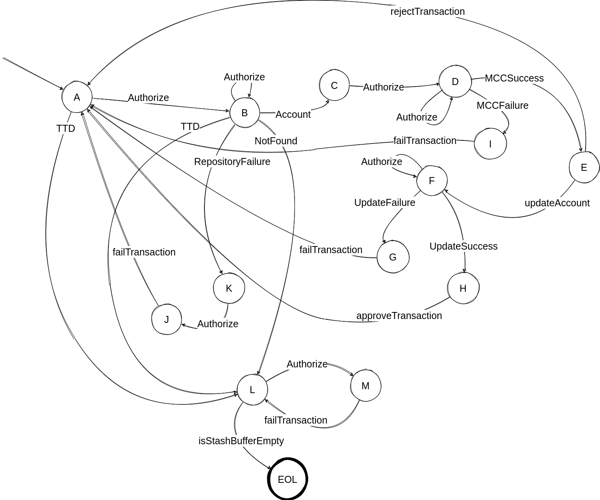

# caju

Desafio backend

O código fonte também está disponível na minha conta no github [caju](https://github.com/rthoth/caju), caso a visualização desse arquivo Markdown não sejá muito agradável sem alguma ferramenta para visualizá-lo.

## Plataforma

O projeto foi escrito em Scala (2.13.6) usando como plataforma principal o Akka (2.6.8) e Akka Http (10.2.4). O banco de dados utilizado é o MongoDB (5.0.0).

## Build

Como um projeto Scala será necessário instalar o [sbt](https://www.scala-sbt.org/).

**Aviso importante**: Nos testes automáticos eu utilizo uma lib [docker-it-scala](https://github.com/whisklabs/docker-it-scala) para levantar uma instância do MongoBD e assim o código é testado em vários momentos com um banco de dados real. Essa lib precisará que o seu usário possa utilizar o docker, nas distribuições Linux que já usei basta você adicionar o grupo docker ao seu usário aí não será necessário nenhum privilégio de super usuário para executar os testes.

O projeto foi criado para gerar imagem docker com a aplicação, para gerar imagem local basta abrir o terminal do sbt dentro do projeto e digitar:

```
docker:publishLocal
```

Será criada uma imagem docker `caju/rthoth-authorizer:1.0.0` ela que deverá ser utilizada.

## Execução

Para facilitar um pouco o processo de testagem manual/automática você precisará instalar o [docker-compose](https://docs.docker.com/compose/), após isso só verificar que no projeto há um diretório `docker` onde está configurado um ambiente com uma instância da aplicação, uma instância MongoDB e uma ferramenta ([Locust](http://locust.io)) que costumo utilizar para fazer alguns testes mais simples de carga.

Para executar basta ir com o terminal nesse diretório e chamar o `docker-compose`:

```
docker-compose up authorizer locust
```

Dessa forma como está aí apenas a saída padrão do containers da aplicação (authorizer) e do locust serão exibidos no terminal.

A aplicação está configurada por padrão para ouvir na porta `9999`. Então para invocar o serviço basta chamar:

```
http://localhost:9999/authorize
```

Na descrição do desafio não foi definida nenhuma instrução de como criar as contas onde serão feitas as operações. Caso seja necessário para criar/atualizar as contas basta fazer como o exemplo abaixo:

```
POST http://localhost:9999/account

{
    "code": "XXXXX",
    "meal": 10000,
    "food": 10000,
    "culture": 10000,
    "cash": 100000
}
```

Internamente os valores monetários são representados como inteiros de centavos, apenas nesse serviço `POST http://localhost:9999/account` você precisa informar os valores em centavos. No serviço do desafio não é necessário fazer isso.


Caso tenha curiosidade de ver o Locust ele estará em `http://localhost:8089`.


## Sobre o teste L4 e a implementação

Primeiramente. Como estamos falando de operações financeiras, imagino que talvez algumas transações realizadas quase ao mesmo tempo sejam um indicativo de fraude. Não sei, foi a primeira coisa que me ocorreu. Feito o comentário, como escrevi o desafio em Akka optei por implementar um ideia para resolver o problema. A solução é basicamente implementar o processo de autorização de transações em duas etapas, na primeira um *Manager* é responsável por alocar um *Ator* temporário responsável por liberar as transações para uma conta, enquanto esse *Ator* estiver *vivo* os pedidos para aquela conta são direcionados para ele, aí utilizo o modelo de atores implementado pelo Akka para garantir que as operações são feitas de forma não bloqueante e sequencial para aquele cartão e paralelas em relação as operações em outros cartões.



A imagem [L4.png](L4.png) mostra uma máquina de estados desse *Ator*.

**A**: Representa o momento onde o ator espera o próximo pedido de autorização (Authorize) e também é o estado inicial.

**B**: Assim que um pedido chega o *Ator* procura em banco de dados as informações sobre a conta, equanto isso se outros pedidos forem feitos eles ficarão na lista de espera.

**C**: Quando a informação da conta chega se inicia o processo de detectar o `mcc` solicitado pelo teste **L3**. Nesse caso foi feita uma consulta simples em uma coleção no MongoDB com os dados dos *Merchants* conhecidos. Enquanto o `mcc` não for resolvido se outros pedidos forem feitos eles ficarão na lista de espera.

**E**: Com a etapa de determinação do `mcc` concluída é calculado o débito na conta, segundo as regras **L1** e **L2**. Se a categoria do benecífico tem saldo é debitada dela, se não tiver é debitada da categoria *especial* **CASH**. Nesse caso implementei a determinação dos categorias em código mesmo, pelo que vi não haveria uma necessidade de uma dinamicidade para essa parte do desafio. Se não for possível realizar a transação é rejeitada e o *Ator* voltará para o estado inicial **A**.

**F**: Podendo realizar a operação a conta será atualizada, enquanto isso se outros pedidos forem feitos eles ficarão na lista de espera.

**G**: Se ocorrer uma falha na atualização da conta será enviada a resposta que a transação falhou e o *Ator* será direcionado para o estado inicial, se houver pedidos na lista de espera eles serão processados.

**H**: Se a atualização do banco foi bem sucedida será enviada a resposta indicando que a transação foi aprovada e o *Ator* voltará para o estado inicial, seguindo a mesma lógica de transição de **G**.

**I**: Se ocorrer uma falha na detecção do `mcc` será a enviada a resposta que a transação falhou e o estado será alterado para o inicial **A**, havendo solicitações pendentes eles serão processadas.

**K** e **J**: Se ocorreu uma falha com o repositório (MongoDB) de dados das contas o *Ator* ficará nesse estado, e o primeiro pedido de autorização que originou a o pedido será considerado falho e aí o estado será alterado para o inicial.

**L**: Esse estado pode ser alcançado de três formas. Quando em **A** o ator pode receber uma mensagem **TTD** (Time To Die) ou o estado **B**, nesses dois estados o ator está ocioso esperando novas solicitações ou esperando a informação da conta do banco de dados, se caso o ator ficar muito tempo (por volta de 100ms) ele recebe essa mensagem e entende que não pode mais continuar vivo. Importante, se caso o ator sair dos estados **A** e **B** antes da mensagem TTD chegar a contagem será reiniciada, indicando que há mais pedidos para aquela conta. Outra forma que o estado **L** pode ser alcançado é se a conta **NÃO** existir, nesse caso todas as transações serão canceladas! Uma vez alcançado esse estado o ator irá morrer, aí todas as transações em espera (no caso do banco estar lento) serão notificadas que falharam e o ator morrerá.

## Considerações

Sobre representar os dados monetários como inteiros de centavos, sei que para esse tipo de dado a representação de ponto flutuante gera alguns probleminhas e usar alguma solução de precisão aribrária nesse caso não seria necessário, visto que é utilizada apenas uma operação de subtração e jogar o problema para representação com inteiros já é bem eficiente.

Espero de alguma forma a explicação e código sejam interessantes.

Novamente obrigado pela oportunidade.


Obrigado,

Ronaldo Aparecido da Silva.